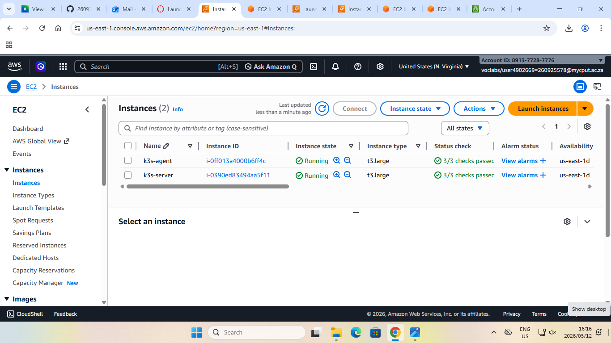

https://github.com/260925578/assignment-1-FortunateAneliswaMajozi.git

Purpose
Deploy a lightweight Kubernetes cluster (k3s) on AWS, document the deployment, demonstrate evidence, and reflect on the work. This develops technical, problem-solving, documentation, and professional skills.

student number: 260925578
name(s): Fortunate Aneliswa
surname: Majozi

Steps for installation and commands:
1.	I created 2 EC2 Instances and named them k3s-server and k3s-agent separately.
•	Their instance type is t3.large
•	Operating system: Ubuntu 24.04
2.	I created a security group for instances.
3.	I configured the k3s-agent instance using the following commands:
4.	
•	#Ssh into node

ssh -i ~/.ssh/$k3s-agent.pem ubuntu@54.83.244.203 

•	Install k3s

curl -sfL https://get.k3s.io | sh –

sudo kubectl get nodes

sudo kubectl get pods –A

•	Deployment 

             kubectl apply -f web-app.yml
             
sudo chmod 644 /etc/rancher/k3s/k3s.yaml

export KUBECONFIG=/etc/rancher/k3s/k3s.yaml

kubectl get nodes

#install helm

Curl https://raw.githubusercontent.com/helm/helm/main/scripts/get-helm-3 | bash

#Deploy nginx using Helm

helm repo add bitnami https://charts.bitnami.com/bitnami

helm repo update

helm install my-nginx bitnami/nginx

6.	I also configured the k3s-server instance using the same command I used in agent, the only difference is the key pair and public IP address:

•	#Ssh into node

ssh -i ~/.ssh/$k3s-server.pem ubuntu@ 98.87.165.223  

•	Install k3s

curl -sfL https://get.k3s.io | sh –

sudo kubectl get nodes

sudo kubectl get pods –A

•	Deployment 

             kubectl apply -f web-app.yml
             
sudo chmod 644 /etc/rancher/k3s/k3s.yaml

export KUBECONFIG=/etc/rancher/k3s/k3s.yaml

kubectl get nodes

#install helm

Curl https://raw.githubusercontent.com/helm/helm/main/scripts/get-helm-3 | bash

#Deploy nginx using helm

             helm repo add bitnami https://charts.bitnami.com/bitnami
             
 helm repo update
 
 helm install my-nginx bitnami/nginx

##System requirements
Instance type: t3.large
CPU: vCPUs(2)
Disk: 50G
RAM:7.6Gi

ARCHITECTURE EXPLANATION
What is K3s?
K3s is designed for resource-constrained situations. K3s is a lightweight, fully compliant Kubernetes distribution. It is simple to install, run and manage because it bundles all necessary Kubernetes components into a single binary.
K3s is employed due to the following reasons
•	It uses less memory and CPU than complete Kubernetes.
•	is easy to customize and quick to install.
•	is perfect for development environments, IoT, and edge computing.
•	simplifies Kubernetes while preserving its essential features

Because of this, K3s is appropriate for cloud deployments (such as AWS EC2) and edge situations where speed and efficiency are crucial.

KEY COMPONENTS
The control plane is the brain of the Kubernetes cluster. In K3s, it is simplified and runs as a single service. IT is responsible for handling pods.
Agent nodes are where application workloads run. They  receive instructions from the control plane and run pods.
The container runtime is responsible for running containers.
The CNI provides networking between pods and services inside the cluster. K3s uses flannel, which enables pod-to-pod communication and IP address allocation for pods. 
Ingress and load balancing manage external access to applications. They route external traffic to the correct services and enable exposure of the application to the internet. 
Storage in k3s uses supports persistent volumes and persistent volume claims, which allows applications to store data reliably even if containers restart.

##Evidence of Deployment

## Nodes

# PODS

# Deployment

TECHNICAL REFLECTION
What I learned:
This assignment gave me hands-on experience setting up a lightweight Kubernetes cluster on AWS with k3s. I became proficient in configuring an EC2 instance, a cloud-based Linux server.
Using straightforward commands to install and maintain a Kubernetes distribution.
deploying and managing apps, using tools like Helm and kubectl, and recognizing how a cluster's containers are coordinated.

I was able to go beyond theory and comprehend how cloud native apps are actually implemented and maintained in real-world settings.
Challenges I faced:
One of the main challenges I encountered was permission errors, such as “permission denied: /etc/rancher/k3s/k3s.yaml”. I resolved this error by using  sudo and adjusting file permissions where necessary. I also faced connectivity issues with the cluster, which I fixed by ensuring the kubeconfig file was correctly exported and accessible. These challenges improved my troubleshooting skills and taught me how to read and interpret error messages effectively.
 How k3s relates to production Kubernetes / 5G cloud-native concepts
Although K3s is a streamlined, lighter version of Kubernetes, it nevertheless makes use of the same fundamental ideas, including pods, services, deployments, and orchestration of containers

Large-scale systems in production settings need complete Kubernetes, whereas k3s is best suited for computing on the edge, IoT settings, and systems with limited resources.

K3s allows for the lightweight deployment of cloud-native apps at the edge, which is a fundamental concept in 5G designs. This is particularly pertinent to 5G networks, because services must operate closer to consumers (edge computing) to reduce latency.

How virtualization and containerization enable scalable services
By enabling several virtual machines (VMs) to operate on a single physical server, virtualization increases flexibility and resource efficiency.

Containerization expands on this by packaging applications with all dependencies, maintaining uniformity in various settings, facilitating rapid deployment, and expansion

Containers in Kubernetes (and K3s) can be scaled up or down depending on demand, they can be restarted if they don't work, and dispersed throughout several nodes. This increases the complexity of systems to be expandable, adaptable and effective.
Highly scalable, cloud-native services are made possible by virtualization and containerization, which together form the basis of contemporary cloud computing.

 
