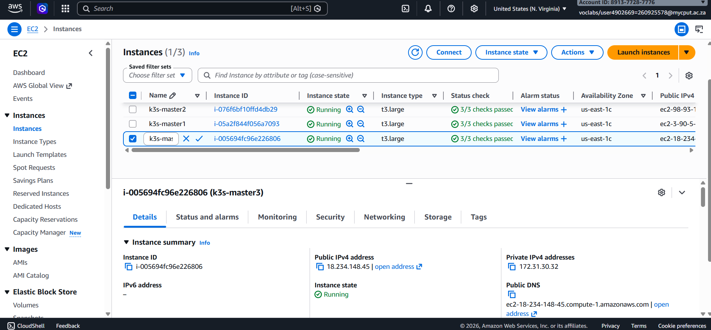
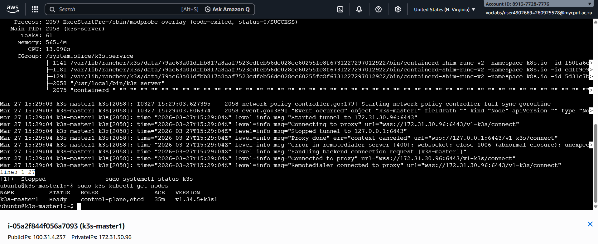
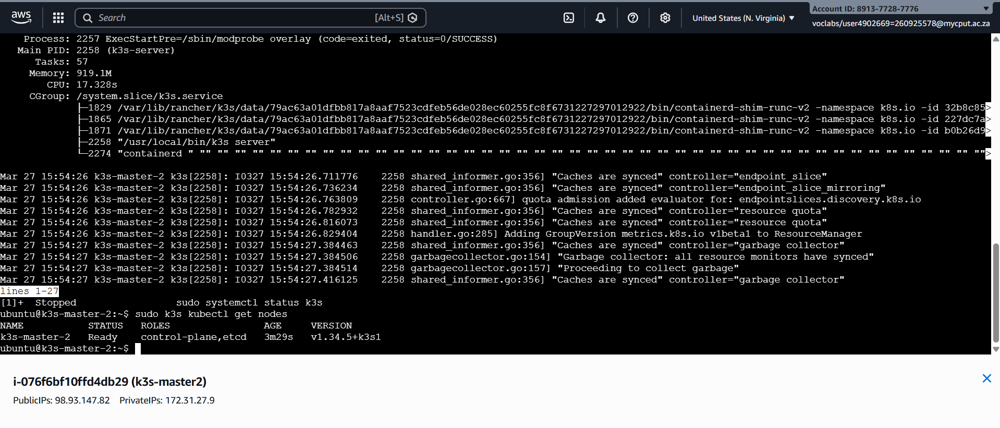
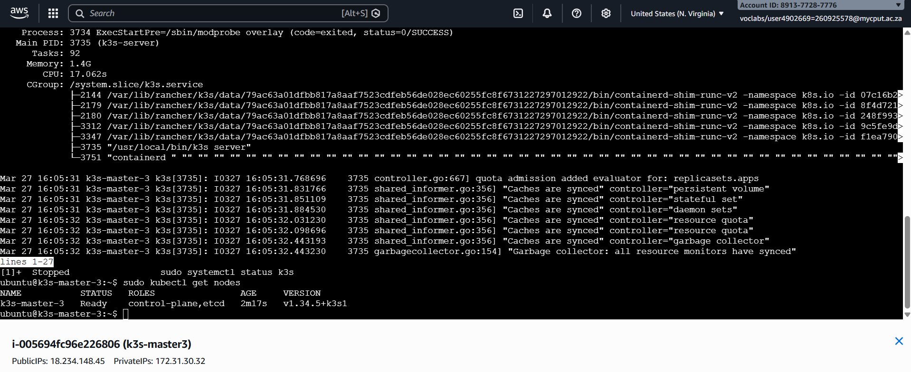
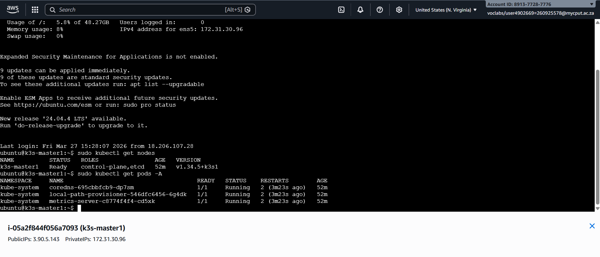
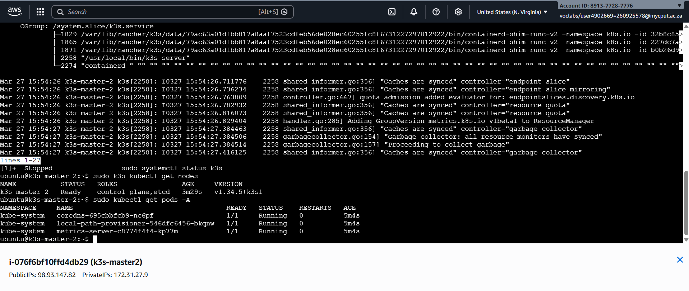
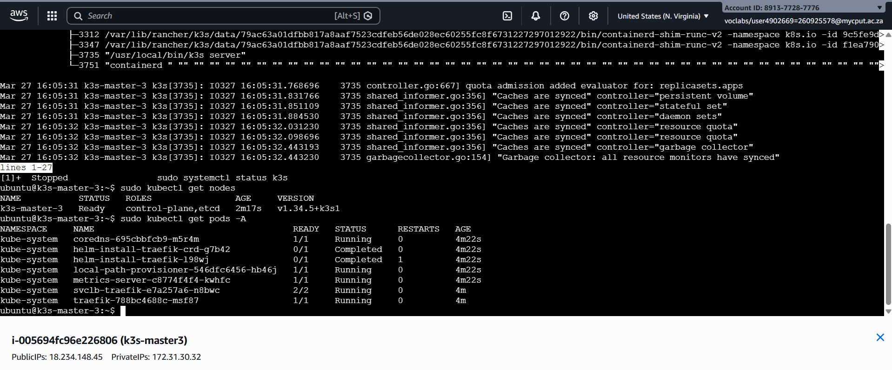
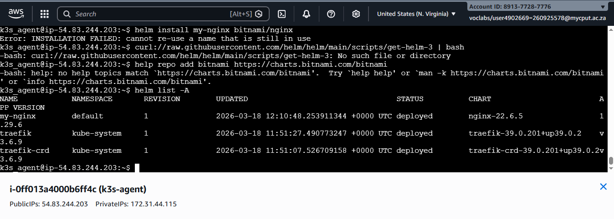
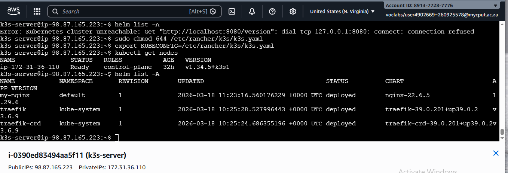

https://github.com/260925578/assignment-1-FortunateAneliswaMajozi.git

Purpose
Deploy a lightweight Kubernetes cluster (k3s) on AWS, document the deployment, demonstrate evidence, and reflect on the work. This develops technical, problem-solving, documentation, and professional skills.

student number: 260925578
name(s): Fortunate Aneliswa
surname: Majozi
            
##System requirements
| ;-- | ;-- |
| **Instance type** | t3.large|
| **CPU** | vCPUs(2)|
| **Disk** | 50G |
| **RAM** |7.6Gi |

ARCHITECTURE EXPLANATION
What is K3s?
K3s is designed for resource-constrained situations. K3s is a lightweight, fully compliant Kubernetes distribution. It is simple to install, run and manage because it bundles all necessary Kubernetes components into a single binary.
K3s is employed due to the following reasons
•	It uses less memory and CPU than complete Kubernetes.
•	is easy to customize and quick to install.
•	is perfect for development environments, IoT, and edge computing.
•	simplifies Kubernetes while preserving its essential features

Because of this, K3s is appropriate for cloud deployments (such as AWS EC2) and edge situations where speed and efficiency are crucial.

KEY COMPONENTS
The control plane is the brain of the Kubernetes cluster. In K3s, it is simplified and runs as a single service. IT is responsible for handling pods.
Agent nodes are where application workloads run. They  receive instructions from the control plane and run pods.
The container runtime is responsible for running containers.
The CNI provides networking between pods and services inside the cluster. K3s uses flannel, which enables pod-to-pod communication and IP address allocation for pods. 
Ingress and load balancing manage external access to applications. They route external traffic to the correct services and enable exposure of the application to the internet. 
Storage in k3s uses supports persistent volumes and persistent volume claims, which allows applications to store data reliably even if containers restart.

##Instances

## Nodes

# PODS

# Deployment

TECHNICAL REFLECTION

 
